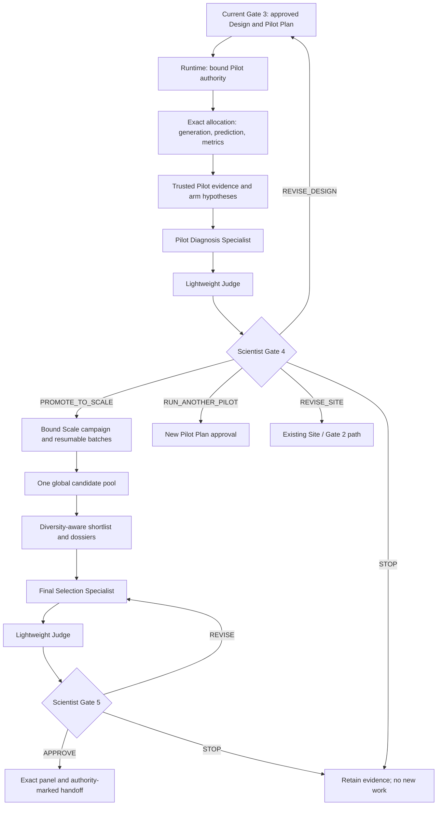

# EasyDesign v3 Phase 3/4 — integration acceptance

Status: **ENGINEERING ACCEPTANCE PASS**. Phase 3/4 are closed for the bounded validation scope below.

## Repository authority

| Role | Exact revision |
| --- | --- |
| Current Phase 2 base | `fce5d886849edf575ec1765f7226064291857d49` |
| Donor reference | `07d2a6a24d1a3d622f01ac58d3e983aafbcbd3e4` |
| Integration branch | `codex/easydesign-v3-phase34-integration` |
| Frozen implementation | `16fdf2519240e29eb67a575b896f347d6b34b75c` |
| Closure checkpoint | `checkpoint/easydesign-v3-phase34-integration-complete-20260915` |

Server: `suzhou2`. Integration worktree:
`/data/easydesign-worktrees/v3-phase34-integration-20260915`.
The actual Phase 2 HEAD was newer than the historical `d775a5db` in the request.
This work starts from the inspected current HEAD. The original Phase 2 checkout remains
clean on its original branch; the donor remains unchanged, including its pre-existing
untracked `archives/`. The donor was selectively forward-ported, never merged wholesale.

## Delivered architecture

Runtime owns compilation, identity, allocation, worker recovery, prediction, metrics,
lineage and actual transitions. The two specialists interpret scientific evidence.
Judge critiques; it neither reranks candidates nor chooses a workflow route.
Scientist responses remain the only source of consequential Gate authority.
There are no Generation, Prediction, Filtering or Metrics agents and no autonomous
multi-Pilot loop. CLI scopes `--through pilot` and `--through handoff` enable the new
path; existing `--through design` retains Phase 2 behavior.

Standalone donor foundations include `phase3.py`, `phase4.py`, `phase34_contracts.py`,
`phase34_bridge.py`, `phase34_fixtures.py`, `replay_phase34_control_flow.py`,
`stress_phase4_global_pool.py` and `validate_phase34_gate3_fixtures.py`.
Shared `cli.py`, `contracts.py`, `control_flow.py`, `harness.py`, `models.py`,
`session_store.py`, `phase2_tools.py` and `site_contracts.py` were reconciled manually.
New `phase34_*` adapters provide plan/authority, execution, measurement, compact science
packets, native specialists, cards, Scale batches and partial-reference collection.
The deterministic scientific kernel is unchanged.

## Phase 3: execution and scientific interpretation

Gate 3 approval binds the current project, Target revision, Scientist-selected Site,
Design, compiled strategies, scientific arm intent, Pilot Plan, backend policy and
exact allocation. A historical Design approval without this plan does not authorize
new Pilot work. Stale cards, changed plans and foreign identities fail deterministically.
One authority owns one resumable run; retries do not create a second execution.

Arm hypotheses, rationale, changed/held factors, expected results, failure interpretation,
binding/not_binding, scaffold/CDR configuration and target context survive into diagnosis.
Repeated strategy settings are factored losslessly in the model working set.
The complete stored contracts and hashes remain authoritative.

Planned, generated, valid, independently predicted and metric-evaluable counts are
distinct. Missing metrics, backend failures and failed attempts are explicit.
A generated candidate can subsequently fail prediction; these populations overlap.
Historical filter thresholds remain audit annotations, not automatic scientific truth.
The existing Stage 04 worker performs exact-scope generation; v3 invokes prediction
and metric kernels without the old Stage 05 automatic candidate expansion.

`PilotDiagnosisOpinion` contains:

- Key observations and one hypothesis finding per Design arm.
- Arm comparisons, alternative explanations and operational confounders.
- Uncertainty and a next discriminating experiment.
- Recommended Gate 4 action and rationale; proposed strategy allocation only for Scale.

The opinion has short bounded fields and one submission tool. Runtime binds it to the
trusted evidence and checks arm/candidate identities. Real model calls use the existing
64-call budget and context guard. Judge returns `NO_MATERIAL_ISSUE` or `CONCERNS`, brief
rationale, warnings, uncertainties, overclaim corrections and optional structured fact
references. Technical review failure remains visible; fact contradictions cannot be
converted into an unavailable-review fallback.

| Gate 4 choice | Deterministic effect |
| --- | --- |
| `PROMOTE_TO_SCALE` | Bind the exact reviewed strategy allocation and upstream identity. |
| `RUN_ANOTHER_PILOT` | Prepare a new plan; require explicit plan approval before dispatch. |
| `REVISE_DESIGN` | Return through Binder Strategy / Gate 3 with diagnosis context. |
| `REVISE_SITE` | Return through Site / Gate 2; retain verified Target context. |
| `STOP` | Retain evidence and schedule no new scientific work. |

Micro validation is limited to at most six candidates and always scientifically
`INCONCLUSIVE`. This assignment used three. Zero-pass micro results cannot establish
Site failure, Design failure or justify scientific Scale promotion.

## Phase 4: global competition and handoff

Scale authority binds Gate 4 promotion, Design/revision, selected strategies and exact
total allocation. Immutable batch plans and append-only receipts retain recovery and
candidate lineage. All evaluable candidates across batches compete in one pool; the
system does not concatenate per-batch winners. Failed and unevaluable observations
remain visible. The bounded shortlist orders review effort; development score is an
engineering signal, not biological fitness.

`FinalSelectionOpinion` contains primary and backup candidate IDs, selection rationale,
major risks, diversity coverage, unresolved questions and an explicit reason for any
panel-size shortfall. Runtime rejects unknown/duplicate/overlapping IDs. Judge critiques
the proposal without rebuilding ranking. Gate 5 approval binds the exact displayed
panel. Revision creates a new review identity even when candidate membership is unchanged;
STOP creates no handoff; repeated application is idempotent.

Superseded worker evidence invalidates stale Gate 4/5 cards and native interrupts.
Retiring an obsolete interrupt never fabricates a human response. Validation-derived
handoffs retain `validation-only-not-authorized-for-experiment` and `not-ordered`.
They cannot authorize experiments, even if some upstream context had formal approval.

## Validation results

### Real NK2R engineering micro

The isolated project reuses the current selected Site B:
`C167 I202 Y206 W263 Y266 F270 Y289`. It preserves the three GPCR arms currently presented at Gate 3 and their full seven-scaffold Design. All 21 real YAMLs passed the current compiler
and backend validator, retaining 87/87/93 exclusions by arm. Only one 7eow candidate
per arm was generated. The original NK2R project and pending scientific Gate 3 remain
untouched; a separate validation authority permitted the bounded micro.

- BoltzGen: **3/3 generated**, after recovery from the same run's bounded GPU wait.
- AFO **3.1.4 / OpenFold3 P2**: **3/3 verified independent predictions**.
- Target MSA: 9,330 records, bound to the exact target sequence.
- Full target prediction: 398 residues; experimental reference: 297 observed residues,
  numbered 25–321. Every shared residue identity agrees.
- The old complete-reference collector retried each exit-zero prediction once before
  the discrepancy was diagnosed: **six bounded prediction attempts in total**.
  The corrected v3 adapter retains each candidate's first verified complete product,
  with all original attempts preserved. No additional GPU run was used for recollection.
- Confidence and full-target clash metrics are retained. Target-aligned binder RMSD
  and target CA RMSD remain explicitly unavailable; no zero or subset-alignment value
  was invented. Future partial-reference collection uses one bounded attempt per candidate.

| Arm | Pairwise ipTM | Minimum interface PAE (Å) | Binder pTM | Severe / moderate clashes |
| --- | ---: | ---: | ---: | ---: |
| Full-pocket | 0.11 | 23.4 | 0.22 | 0 / 0 |
| Surface-subset | 0.14 | 21.2 | 0.20 | 0 / 0 |
| ECL3-coupling | 0.15 | 19.3 | 0.35 | 0 / 2 |

These are measured engineering evidence, not demonstrated NK2R binding or inhibition.
Measurement v2 is immutable and idempotent, SHA
`42c425244feabb02bfcf34cbaa3d3e2f508956b9c1461725eb4b23b18e7a25d0`.
The frozen measurement replay starts no new backend. The Scale projection adapter also
accepts the same real evidence in a saved replay without Scale authority or compute.

Frozen native Pilot Diagnosis/Judge → Gate 4: **PASS** on `16fdf251`.
Diagnosis submitted on its first call. Judge's first structured response cited a
measurement digest as an unknown fact ID and was correctly rejected; the first repair
hit its output limit; the second repair submitted a valid `CONCERNS` review. Four real
DeepSeek v4 Pro calls used 137,188 provider-reported tokens. Maximum input including
schema was 90,629 characters, below the unchanged 100,000 hard guard and above the
60,000 soft target. The bounded repair path succeeded without review fallback.

Gate 4 explicitly shows `INCONCLUSIVE`, recommends `RUN_ANOTHER_PILOT` and disables
scientific `PROMOTE_TO_SCALE`. It retains the measured denominators, missing RMSDs,
arm hypotheses and critique. The recommendation has not been approved or executed.
The original experimental context and downstream computational measurements remain
distinct; neither Diagnosis nor Judge prose replaces authoritative runtime facts.

### Native Phase 4 and real model calls

Frozen `d366a903a2b01741639fb492f8fcd9143ed8052b` passed native Gate 4→Final Selection
→Judge→Gate 5→idempotent handoff on an explicitly synthetic pool. Final Selection used
one schema repair for an unnecessary shortfall explanation; Judge succeeded first try
and highlighted sequence-identical backups. Three actual DeepSeek v4 Pro calls used
8,506 provider-reported tokens, maximum input 7,538 characters including schema.
The two-primary/two-backup handoff remains validation-only and not ordered.
This verifies model and control-flow integration, not biological candidate performance.

### 50,000-candidate software stress

**PASS**: 50,000 synthetic candidates retained; 49,949 evaluable and 51 unevaluable;
50 batches. One failed and one resumable batch recover. Fifty duplicate ingestion
replays do not duplicate candidates. A fresh subprocess reconstructs the identical
persisted pool and a 30-candidate shortlist with synthetic cluster cap two.
Pool SHA: `64b582e1f7ce37131c59f46d8b4f3c8fb7d6017e6c67c24fb5c2e6376d21f168`.
This is neither a biological benchmark nor a GPU throughput benchmark.

### Regression and integrity

- Post-correction complete Python coverage: **1,201 passed, 11 skipped**, covering
  all 1,212 collected node IDs on unchanged `16fdf251` code. Initial shards were
  disjoint. Eleven tests encountered missing-fixture setup errors in explicit file-list
  collection (8/1/2 by shard), before their assertions could run. Normal `tests/` directory
  collection with exact node-ID selection then passed all eleven. Initial errors and
  recovery receipts are retained; this is not represented as one error-free invocation.
  The 11 skips are three opt-in live smoke tests and eight independent PyMOL checks.
- Earlier frozen `d366a903` full suite: **1,197 passed, 11 skipped**, two existing SDK
  warnings. The source remained fixed through its full 44-minute run.
- New partial-reference checks: **6 passed**, including four new tests plus the
  existing incomplete-prediction and lossless-packet tests.
- Whole-repository Ruff: **PASS**. Configured mypy: **PASS, 224 source files**.
- Browser regression: **5 passed, 2 optional historical-report checks skipped**.
- Saved standard/native Gate 3 downstream replays: **PASS**.
- Current Phase 2 mainline and donor: original commits preserved. All **461** protected
  files unchanged; accepted Cases **1/3/4/5** request/receipt hashes and applicable tags
  preserved. Original NK2R Gate 3 has no new response.

Earlier failed development attempts remain in the runtime audit record. A mutable-source
test run was rejected by the Harness fingerprint guard and is not acceptance evidence.
The final run uses frozen code; the guard was not weakened.

## Evidence index and reproducibility

All paths below are under the integration worktree's `runtime/tmp/`:

| Evidence | Record |
| --- | --- |
| Current real measurement | `nk2r-micro-frozen-measurement-03.json` |
| Real Pilot native Gate 4 | `nk2r-micro-gate4-01.json` and `nk2r-micro-gate4-usage-01.json` |
| Real Scale projection replay | `scale-real-measurement-projection-01.json` |
| Native synthetic Gate 4→5 with real models | `phase34-live-native-final-result-01.json` and `phase34-live-native-final-usage-01.json` |
| Synthetic disk/restart stress | `phase4-50k-stress-02.json` |
| Final suite coverage | `final-regression-plan-04.json`, `final-regression-shard-04-{1,2,3}.json` |
| Unexecuted setup-error recovery | `final-regression-setup-recovery-05-{1,2,3}.json` |
| Final integrity | `phase34-final-integrity-03.json` |
| Browser | `web-browser-tests-02.log` |

Runtime evidence, model installations and credentials are not embedded in source docs.
The [checked receipt manifest](validation/phase34-integration-20260915.json) records evidence hashes and acceptance counts.
Existing validation scripts and tests remain in the repository; replay does not require
production compute. Every checkout owns its environments and model assets.

## Limits and explicit scope confirmation

Phase 2 ranked A/B/C Site behavior, actual B/C downstream selection, runtime facts,
Judge resilience, GPCR templates/not_binding, stale-card protection, restart/idempotency,
64-call budget and context guard remain intact under regression. No fresh Gate 1–3
scientific run was needed for this downstream integration.

The three-candidate micro cannot establish binding, inhibition, Site quality, arm
superiority or production yield. Complete-reference RMSDs remain unavailable for this
partial structure. Exact-sequence groups detect duplicates; structural/pose diversity
is not yet validated. External MSA and GPU availability remain runtime dependencies.
Judge can be technically unavailable, but hard facts and Scientist authority stay enforced.

**No production-scale Pilot/Scale, 50k protein generation, wet-lab order or experiment
was performed.** No existing pending scientific Gate was silently approved. Validation
Gate responses used isolated synthetic or micro contexts. This assignment ends at the
validated Gate 5/handoff implementation. It does not start autonomous Pilot looping,
self-evolution, Workbench/UI redesign or later benchmark work.
