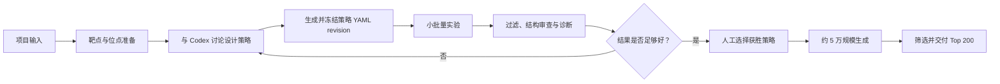
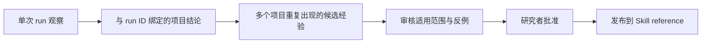

# EasyDesign Local 产品理念与 Agent 原生研究范式

> 本文解释 EasyDesign Local 为什么存在、它希望规范什么，以及 EasyDesign、Skill、Codex
> 和研究者应如何协作。强制性安全规则以 `AGENTS.md`、`DATA_SAFETY.md` 和
> `docs/CHARTER.md` 为准；源码边界以 `docs/ARCHITECTURE.md` 为准。

## 1. 我们真正要解决的问题

团队原有的蛋白设计流程并不是缺少单个算法，而是缺少一种能够长期复用的研究秩序：

- 合作者给出的输入不统一，可能是已标色 PSE、结构加文字位点、序列、PDB/UniProt，或只有
  一个尚不明确的生物学目标；
- 位点、target crop、CDR 长度、scaffold 和生成参数依赖经验，不能由固定向导一次决定；
- 小批量结果经常需要诊断后重新设计，负结果也是有价值的科学证据；
- 关键理由容易只存在于一次对话中，参数、产物和结论之间缺少稳定关联；
- 临时脚本虽然能完成任务，但文件位置、输入输出、恢复方式和证据强度不一致；
- 新 Codex 上下文拥有通用推理能力，却不知道团队已经积累的工具、经验和失败模式。

EasyDesign Local 的目标不是把研究者替换成自动流水线，也不是把全部经验硬编码成规则。它要
把团队经验、Codex 推理和确定性软件组合成一个可恢复、可讨论、可审计的本地研究工作台。

一句话定义：

> Codex 是主要研究交互界面，研究者掌握关键科学批准，EasyDesign 提供可靠工具和科学秩序，
> Skill 提供经过审核的经验与判断框架。

## 2. 真正的流程不是七个线性 Stage

实际设计流程以迭代为核心：



回到策略讨论不是流程失败，而是产品必须支持的正常主路径。每轮 pilot 都应留下不可变输入、
产物、过滤结果和诊断，下一轮在这些证据上形成新的假设，而不是覆盖旧 YAML 或旧 run。

因此面向研究者的产品阶段固定为：

| 阶段 | 要解决的问题 | 主要产物 | 人工 gate |
| --- | --- | --- | --- |
| `prepare` | 靶点、编号和位点是否可信 | target/site foundation | 批准 site |
| `strategize` | 这轮准备验证哪些设计假设 | strategy draft 与冻结 revision | freeze strategy |
| `pilot` | 小批量结果支持或反驳什么 | 独立 pilot run、review、下一版策略 | 启动与 promote |
| `scale` | 哪些已批准策略值得投入生产预算 | production plan 与 run | 启动 scale |
| `select` | 哪些真实候选应进入交付 | 排名、证据包和真实 Top N | 启动 select |

内部 Stage 1–7 暂时继续保存已经验证的科学契约：Stage 1/2 支撑 `prepare`，Stage 3 支撑
`strategize`，Stage 4/5 支撑 `pilot`，Stage 6/7 支撑 `scale/select`。这些编号是内部 lineage
和兼容身份，不是研究者必须学习的产品界面。

## 3. 四方职责边界

这条边界比任何命令名称都重要。

### EasyDesign：确定性工具层

EasyDesign 负责“笨但可靠”的工作：

- 获取结构和序列、转换格式、映射 residue 编号并验证链身份；
- 从 PSE 颜色或文字 residue 生成严格 proposal，运行 SASA/ScanNet，提供只读结构查看；
- 校验 YAML schema、默认值、revision、checksum 和不可变冻结；
- 调用 BoltzGen、Protenix/OpenFold3、TNP 等 backend，并记录精确环境和模型身份；
- 管理 GPU、持久 worker、状态、恢复和安全 drain；
- 执行 filter、排名、manifest、artifact、attempt 和 checksum；
- 输出稳定的类型化 JSON，使新上下文可以准确恢复状态。

它不得偷偷选择表位、修改策略、静默 fallback、补齐不存在的候选，或把运行失败解释成科学
负结果。相同输入和相同运行身份必须产生可追踪、可解释的执行记录。

### Skill：审核后的知识层

Skill 保存不能简单写成算法、但可以指导判断的经验：

- 哪类 target 值得裁剪，裁剪可能损失什么；
- hotspot 应多选还是少选，表位几何如何影响选择；
- CDR 长度、插入范围和 scaffold 如何形成有信息量的小实验；
- pilot 失败时应先看 site、YAML、生成模型、结构预测还是 filter；
- 什么证据足以放大，什么信号要求重新设计。

Skill 不执行下载、染色、生成或过滤，也不复制 CLI 脚本。它只说明何时、为什么调用工具，
怎样比较证据，以及已审核经验适用于什么范围。

### Codex：推理与编排层

Codex 负责把当前项目、工具结果和经验连接起来：

- 读取 `easydesign project status PROJECT --json` 恢复唯一可信状态；
- 询问缺失的生物学背景和合作方意图；
- 提出多个可区分的策略、理由、预期结果和风险；
- 调用 EasyDesign CLI，把讨论转化为规范文件和可验证任务；
- 阅读结构化 review，诊断失败并起草下一版策略；
- 清楚报告不确定性，在关键 gate 请求研究者批准。

Codex 可以灵活思考，但不能把推断伪装成 artifact 证据，也不能把一次观察自动写进正式
Skill。

### 研究者：目标与最终科学判断

研究者保留：

- 生物学目标、合作背景和未写入文件的约束；
- site、strategy、pilot promotion、算力预算和规模化批准；
- 对结构、失败原因、风险和最终交付的判断；
- 是否把候选经验提升为团队正式知识。

软件成功运行不等于候选在实验中成立，模型分数也不能代替湿实验、临床或生物安全判断。

## 4. 策略 YAML 是实验假设，不是一次性配置

一份 strategy revision 应回答“这轮想验证什么”，而不只是罗列参数。

- 每轮可以包含多组显式 variant；不同 variant 应尽量对应可解释的假设差异；
- 每组约 40 个设计是经验默认值，用于低成本获得信号，不是不可修改的科学规则；
- 七套 VHH scaffold 是推荐起点，可以全部尝试，也可以根据证据选择子集；
- 不强制 region × scaffold 的全笛卡尔积，避免把算力花在没有问题意识的组合上；
- target crop、binding residue subset、CDR range 和插入长度都必须显式记录并验证；
- rationale 和预期结果用于解释设计，但只有 run 产物、结构和指标才是执行证据。

讨论中的科学参数必须落入 YAML revision；选择理由和未结构化背景写入项目
`DECISIONS.md`。冻结后不得原地修改，任何新假设都创建新的 revision 和新的 pilot run。

## 5. Pilot 循环是产品核心

Pilot 不只是“缩小版生产”，而是将经验转化为可比较证据的实验单元：

1. Codex 和研究者提出一个或多个可区分策略；
2. EasyDesign 校验并冻结策略 revision；
3. 每个 variant 使用合适的小预算运行，默认约 40 个候选；
4. 统一 filter，并保留失败规则、代表结构和可比较指标；
5. Codex 判断问题更可能来自 site、策略、backend 还是过滤标准；
6. 研究者决定修订、继续、停止或 promote；
7. 下一轮创建新 revision 和新 run，旧证据不覆盖。

没有候选通过可以是完整、有效的科学负结果。只有 backend、环境、数据或协议失败才属于运行
失败。产品必须把二者区分，否则 Codex 会从错误证据中学习。

Scale 只消费人工 promote 的策略。默认生产预算约 50,000，默认交付 Top 200，但二者都是
显式可审查的产品默认值；不足 200 个合法候选时只交付真实数量，不重复、不补造。

## 6. 经验怎样进入 Skill

历史经验不能未经审核就变成团队“真理”。知识成熟路径是：



每条正式经验至少记录：

- 适用的靶点、表位或任务类型；
- backend、模型、filter 和关键版本；
- 支持它的 run ID 与可定位证据；
- 观察到的收益或失败信号；
- 已知反例和不适用范围；
- 置信度、审核人和最近复核日期。

单项目观察先写进该项目的 `DECISIONS.md`。Codex 可以起草候选经验，但只有明确的仓库开发
任务和研究者批准才能修改正式 Skill。这样知识会逐步增长，又不会积累成无法追溯的实验室
传说。

## 7. 为什么只保留一个主 Skill

当前知识入口保持简单：

```text
.agents/skills/easydesign-research/
├── SKILL.md
└── references/
    ├── target-and-site.md
    ├── strategy-yaml.md
    ├── pilot-diagnosis.md
    └── scale-and-selection.md
```

`SKILL.md` 只保存工作方法、责任边界、确认 gate 和 reference 路由。Codex 根据当前 phase
只读取一份 reference，不在每轮加载全部经验。后续经验优先平铺增加到现有 reference；只有
出现真正不同的触发场景和生命周期时，才新建另一个 Skill。

`AGENTS.md` 也不承担全部蛋白设计知识。它只是一份稳定、短小的操作宪法：判断研究或开发
入口、规定状态来源和写入位置、划定当前主机执行边界、保护科学数据，并把研究任务路由到
主 Skill。

## 8. 项目文件围绕 Agent 恢复上下文

项目目录保存输入、讨论中的 draft、批准记录和不可变配置 revision：

```text
workspace/projects/<project>/
├── PROJECT.yaml
├── DECISIONS.md
├── strategy-draft.yaml
├── inputs/
├── strategies/
│   └── strategy-rNNNNNN.yaml
├── config-revisions/
│   └── easydesign.rev-NNNNNN.yaml
├── site-proposal.<method>.<run-id>.yaml
├── site-approved.rNNNNNN.yaml
├── CONFIG_CURRENT
├── SITE_CURRENT
├── STRATEGY_CURRENT
└── PROMOTION_CURRENT
```

这里的子目录已经具有多文件规模和独立生命周期，不是为一个文件提前增加的空层级。

科学结构、候选、指标和 manifest 只写入 `workspace/runs/`，不与可变项目讨论混放。
`runtime/` 只保存环境、模型、cache、worker、安装任务和运行态 receipt。三者的边界是：

- project 回答“当前准备讨论和批准什么”；
- run 回答“已经以什么精确身份发生过什么”；
- runtime 回答“本机用什么环境和任务机制执行”。

新 Codex 上下文不扫描这些目录猜状态，而是只调用：

```bash
easydesign project status PROJECT --json
```

这个接口必须足以返回 foundation、strategy revisions、pilot/production runs、待批准事项和
结构化下一步。

## 9. 人工 gate 与自动执行边界

可直接执行的操作包括读取状态、校验、编号映射、染色、site proposal、SASA/ScanNet、资源
规划、review 和只读 Viewer。这些操作产生信息或可再生草稿，不替研究者做不可逆科学选择。

以下操作必须显式确认：

- 发布 approved site；
- freeze strategy revision；
- 启动 pilot、scale 或 select；
- promote pilot 策略进入生产；
- 把项目观察发布为正式 Skill 经验。

高成本任务在确认前必须显示候选数、策略分配、backend、GPU 占用、磁盘余量和精确输入。
`Ctrl-C` 只脱离观察；`drain` 只在安全检查点停止继续调度，不粗暴终止科学进程。

## 10. 借鉴什么，不照搬什么

Agent 原生参考实现最有价值的思想是：Codex 作为主要交互界面、Skill 保存团队知识、工具
执行确定性操作、关键位置保留人工 gate。EasyDesign Local 接受这套思想，但不照搬：

- 不建立大量职责重叠的 Skill、agent 和 script 层级；
- 不把固定三区域、七 scaffold 或 40 个候选写成不可改变的矩阵；
- 不引入远程 executor、受管队列、主机配对或特定集群假设；
- 不再用另一套 G0–G5 或类似名称替换旧 Stage 后继续制造僵硬线性流程；
- 不让 prompt 承担本应由 schema、CLI、checksum 或 worker 保证的正确性。

借鉴的是“Agent 与工具互补”的范式，不是另一个仓库的目录和固定实验策略。

## 11. 对后续开发的约束

新增能力时依次判断：

1. 如果操作要求精确、可重复、可测试，应进入 EasyDesign CLI 或内部 API；
2. 如果内容是依赖上下文的经验判断，应进入经过审核的 Skill reference；
3. 如果是当前项目特有事实，应留在 `PROJECT.yaml`、`DECISIONS.md` 或 run evidence；
4. 如果需要不可逆科学选择，应设置研究者 gate；
5. 如果只是内部实现身份，不应暴露成新的研究者 Stage；
6. 如果三个真实场景尚未证明旧抽象无用，不因外壳重构提前删除科学核心。

因此当前路线不是推倒重来，而是在已验证的 Stage、backend、manifest 和 filter 外建立语义化
Agent façade。只有真实项目反复证明某个旧抽象完全被替代，并通过引用和证据审计后，才考虑
删除。

## 12. 成功标准

EasyDesign Local 成功，不是因为命令数量更多或流程看起来更自动，而是因为：

- 新 Codex 上下文能在几分钟内准确恢复项目，不从零猜团队流程；
- 研究者可以自由讨论和修改假设，同时所有执行参数都有不可变 revision；
- pilot 的成功和失败都能被比较、解释和复用；
- Skill 随证据增长，而不是随聊天次数膨胀；
- 工具结果可重复、可恢复、可审计，主观判断保持显式；
- 最终交付能追溯到 approved site、获胜策略、精确 backend 和完整过滤证据。

这就是本地产品的核心定位：不是“给没有 Codex 的用户使用的七阶段程序”，而是“Codex
驱动、研究者批准、EasyDesign 提供可靠工具和科学秩序的蛋白设计系统”。
