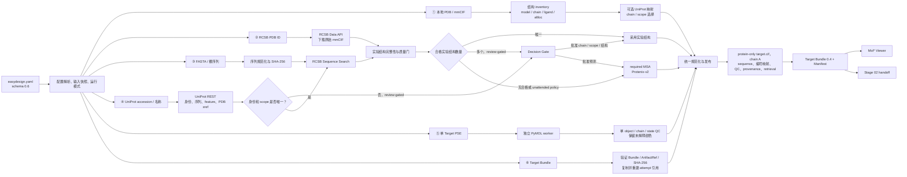

# 01 — Target 准备

**阶段状态：** `smoke-validated`。schema 0.6 的六类入口、严格实验结构选择、
Target Bundle 0.4、通用 Decision Gate、三种 MSA 来源和 Viewer 均已通过
Proteindigger1 真实 smoke；该状态只证明工程流程可运行，不代表科学准确率。

**契约版本：** Target Bundle `0.4`，兼容读取 `0.1`–`0.3`。

## 目的

把六类异构输入解析成规范、可追溯、可由 Stage 02 直接消费的 Target Bundle。



## 支持范围

- 本地 PDB/mmCIF。
- RCSB PDB identifier。
- FASTA 文件或裸氨基酸序列。
- 带物种上下文的 UniProt accession、基因或蛋白名称。
- PyMOL PSE 会话。
- 已经准备好的标准 Target Bundle。

sequence/FASTA 当前只接受单条、由 20 种标准氨基酸组成的输入。FASTA 标题不参与序列
identity；裸序列和同内容 FASTA 必须得到相同规范序列 SHA-256。多记录、空记录和含歧义
残基的输入明确失败，不静默选择第一条记录。

当前用户入口只有一个 `easydesign.yaml`；本地 source 文件路径相对于 YAML 解析。
`stage01.target.source` 是 discriminated union，必须恰好选择 `local-file`、`pdb-id`、
`uniprot`、`uniprot-search` 或 `target-bundle`。`local-file` 再以强证据识别
sequence/FASTA、PDB、mmCIF 或 PSE。识别、联网、结构选择和预测 fallback 均不得静默。

Developer Preview 推荐先通过统一入口创建和运行，不需要 Agent 手工编排：

```bash
easydesign init PROJECT_DIR --target TARGET_FILE --stop-after 1
easydesign config validate PROJECT_DIR/easydesign.yaml
easydesign doctor --config PROJECT_DIR/easydesign.yaml
easydesign run PROJECT_DIR/easydesign.yaml
```

CLI 只调用本阶段相同 Python API；其成功不会提高本阶段的科学证据等级。

PSE 首版只实现可信本地、单蛋白、单链、单 coordinate state 导入。PSE 坐标直接标记为
`imported`，不运行 Protenix、MSA 或其他结构预测；逐残基 CA 颜色保存为
`uninterpreted` source annotation，Stage 01 不把颜色解释成 hotspot。

## 输入

- 恰好一种 source kind 及其专属参数。
- 结构选择规则和显式预测 fallback 规则。
- 可选 chain/domain 选择与生物学约束。

sequence/FASTA 和 UniProt 路径先经 RCSB Sequence Search v2/Data API 寻找实验结构，
只有 design scope 坐标覆盖与序列一致性均为 100%、每个 residue 有 CA 且方法/分辨率
通过 `experimental-strict-v1` 才能自动采用。无唯一候选时才按执行模式进入人工选择或
Protenix fallback。预测通过通用 `StructurePredictionRequest` 访问 backend；1.0 当前
实现为 `protenix==2.0.0` / `protenix-v2`，AFO/AF3 不得成为静默替代。

sequence/FASTA 的用户 YAML 必须声明 `msa` 和 `template_mode`。默认且当前唯一正式主线是
MSA-backed Protenix-v2；用户 YAML 禁止 `mode: disabled`，no-MSA 只保留为 Python API
内部工程 smoke。EasyDesign 保存原始输入和 YAML snapshot，生成
`resolved-config.json`，再由 adapter 生成 attempt 内部 `inputs/protenix-input.json`；
用户不维护 Protenix JSON。

当前标准配置：

```yaml
schema_version: "0.6"
project_id: apoe
workflow:
  execution_mode: review-gated
  stop_after_stage: 1
  cache_mode: online
stage01:
  target:
    id: apoe4-fragment-41-183
    source:
      type: local-file
      path: apoe4-fragment-41-183.fasta
      format: auto
      identity:
        uniprot_accession: null
    scope:
      type: full-sequence
  structure_selection:
    policy: experimental-first
    quality_profile: experimental-strict-v1
    on_no_eligible_candidate: predict
    on_ambiguous_candidates: predict
    preserve_source_context: true
    keep_ligands: []
  structure_prediction:
    backend: protenix-v2
    msa:
      mode: remote
      cache_mode: online
      providers:
        - provider: colabfold-public
          timeout_seconds: 1800
          max_attempts: 3
          retry_backoff_seconds: 30
      no_msa_fallback: false
    template_mode: disabled
    parameter_profile: model-default
stage02: null
stage03: null
stage04: null
stage05: null
stage06: null
stage07: null
```

远程 MSA 配置必须把 provider preset 同时解析成服务模式和明确 endpoint；只传
`--msa_server_mode` 不代表已经切换远程服务。attempt 必须保存 resolved endpoint、
ticket、状态历史、timeout、query identity、输出 A3M identity 和实际深度。endpoint
失败时不得静默切换到另一个 provider 或 no-MSA。

| Provider | Endpoint / mode | 当前定位 |
| --- | --- | --- |
| `colabfold-public` | `https://api.colabfold.com` / `colabfold` | 默认；APOE smoke 已通过，但公共服务无可承诺 SLA |
| `protenix-official` | `https://protenix-server.com/api/msa` / `protenix` | 可显式选择；当前持续 `PENDING`，不进入默认兜底链 |
| `custom-colabfold` | 用户显式 URL / `colabfold` | 自建服务接口；当前尚无 EasyDesign 管理的部署 |

同一 provider 可在声明预算内有限重试；`providers` 的后续成员是显式兜底顺序。正式执行器
让每次重试/切换产生新的 immutable attempt；耗尽 provider 计划后正式失败，不执行
no-MSA。A3M 必须来自当前 attempt、首条 query 与规范 target 完全相同、depth 至少为 2，
才允许启动结构预测。Protenix 2.0.0 CLI 不暴露 ticket，必须明确记录“不可见”状态，不能
伪造 ticket。

MSA 有三条正式且互斥的来源：

```yaml
# 默认：每次重新联网；成功后原子刷新 sequence-hash cache
msa:
  mode: remote
  cache_mode: online
  providers:
    - provider: colabfold-public
  no_msa_fallback: false
```

```yaml
# 用户显式允许读取同 sequence/provider/mode/endpoint identity 的有效缓存
msa:
  mode: remote
  cache_mode: prefer-cache  # 或 offline；offline miss 直接失败
  providers:
    - provider: colabfold-public
  no_msa_fallback: false
```

```yaml
# 用户直接提供 A3M；首条 query 必须与规范 target 逐位相同
msa:
  mode: precomputed
  path: inputs/target.a3m
```

CLI 可在建项目时直接选择：

```bash
easydesign init PROJECT --target target.fasta --precomputed-msa target.a3m
easydesign init PROJECT --target target.fasta --msa-cache-mode offline
```

缓存键包含规范序列 SHA-256、provider、server mode 和 endpoint digest；manifest 保存
query/A3M hash、depth、provider 和生成时间。`online` 不读取旧 cache；
`prefer-cache`/`offline` 必须由用户显式声明。无论来自 remote、cache 还是 precomputed，
实际 A3M 都复制进当前 run，随后仍以 `use_msa=true` 运行 Protenix。
使用公共 provider 会把 target 序列提交给第三方服务；当前只批准内部研究运行。敏感或商业
序列在完成服务条款、隐私和数据处理审查前，必须使用经过批准的自建
`custom-colabfold`/本地 MSA，不得由 UI 静默发送到公共 endpoint。

PSE 路径使用排他的 YAML 分支：

```yaml
schema_version: "0.6"
project_id: apoe
workflow:
  execution_mode: review-gated
  stop_after_stage: 1
  cache_mode: offline
stage01:
  target:
    id: apoe-1b68-pse
    source:
      type: local-file
      path: apoe_abc.pse
      format: auto
      identity:
        uniprot_accession: null
    scope:
      type: full-sequence
  structure_prediction: null
stage02: null
stage03: null
stage04: null
stage05: null
stage06: null
stage07: null
```

PSE 必须省略 `structure_prediction`；提供该区块会明确失败。反之，sequence/FASTA 必须
提供 `structure_prediction`。PyMOL 只存在于独立环境，正式 CLI 从用户级 runtime
profile 读取显式绝对 Python 路径；core 禁止扫描 Conda 或系统 Python，也禁止版本
fallback。

### 六类 source 与 design scope

- `local-file`：FASTA/裸序列、PDB、mmCIF 或严格单 Target PSE；结构可用 auth/label
  chain 显式选择，本地多模型 PDB/mmCIF 保留 ensemble。
- `pdb-id`：获取 RCSB entry/entity/mmCIF；用户显式选择的 PDB 若未通过质量门直接失败，
  不会偷偷换成别的结构。
- `uniprot`：冻结 canonical UniProt JSON/sequence/features/PDB cross-reference，再查
  RCSB 候选。
- `uniprot-search`：必须给 taxonomy ID；只有唯一 reviewed 高置信命中可以自动继续，
  否则产生 identity decision。
- `target-bundle`：验证来源 run 的 ArtifactRef 后复制为新 attempt；identity、scope、
  candidate、context、prediction confidence 和联网响应一并保留并重新建立相对路径。
- PSE 是 `local-file` 的严格专用分支；颜色仍是未解释 annotation。

scope 支持 `full-sequence`、`residue-range` 和唯一匹配的 UniProt `Domain`、`Chain` 或
`Topological domain`。所有正式 `target.cif` 只含 scope 内目标蛋白，输出 chain 固定为
`A`；原始 auth/label chain、author residue、insertion code、reference/UniProt position
和逐模型 presence 进入 mapping。原复合物保存为 `source-context.cif`，白名单配体只进入
额外 `design-context.cif`，绝不污染主 `target.cif`。

### 双运行模式与 Decision Gate

- `review-gated`（默认）：身份、chain/construct、结构候选等有歧义时发布不可变
  `DecisionRequest` 并把 RunManifest 置为 `awaiting-human-approval`。用户通过
  `easydesign decisions export/approve` 提交带 request SHA-256 的选择；批准后在同一
  run 新建 attempt 并继续。
- `unattended`：只接受唯一高置信身份/chain/合格实验结构；没有或存在多个合格结构时按
  YAML 明确转 Protenix，API 错误则直接失败。该模式不调用 LLM。

两种模式共用同一 source、结构规范化和 Bundle 发布实现。DecisionRecord 只追加不覆盖；
旧审批、改变后的 request hash 或已不再 eligible 的选项均被拒绝。

## 输出

- 规范 `target.cif`；PDB 格式可表达时派生兼容 `target.pdb`。
- `sequence.fasta`、可用时的 `reference-sequence.fasta`、机器 mapping JSON 和人读 TSV。
- identity、scope、全部结构候选及淘汰理由、统一 QC、provenance 和 retrieval manifest。
- 有上下文时的 `source-context.cif`，有白名单配体时的 `design-context.cif`。
- `target-bundle.json` 及其中每个 artifact 的相对路径、大小、SHA-256 和生产 attempt。
- `coordinate_ensemble`：model 数量、稳定 model IDs、代表 model 和共享残基身份策略。
- 说明结构属于实验、导入还是预测来源的 manifest。
- PSE 额外输出 `source-annotations.json`，记录 CA color index、RGB、hex 和颜色计数。
  `target.cif` 本身不承载通用显示颜色；Stage 02 必须经 Target Bundle 验证并显式解释
  固定色板，不能看到彩色 CIF 就猜测 hotspot。

联网只使用官方 UniProt REST、RCSB Sequence Search v2、RCSB Data API 和 RCSB mmCIF。
统一 HTTP adapter 对 connect/read 做有界 timeout，429 遵守 `Retry-After`，只有限重试
网络中断/5xx，4xx 不重试。`online`、`prefer-cache`、`offline` 三种 cache mode 必须
显式选择；API failure 不是“零候选”，`online` 失败也不会偷用旧 cache。实际消费的响应、
URL、请求参数、header、时间、大小和 SHA-256 都冻结进 run。

PSE attempt 的稳定目录为：

```text
01-target-preparation/attempt-0001/
├── inputs/pse-request.json
├── work/                         # worker 私有 response 和 raw PDB
├── logs/
└── artifacts/
    ├── target.cif
    ├── target.pdb
    ├── sequence.fasta
    ├── reference-sequence.fasta
    ├── residue-mapping.json
    ├── residue-map.tsv
    ├── identity-report.json
    ├── scope-report.json
    ├── structure-candidates.json
    ├── structure-candidates.tsv
    ├── retrieval-manifest.json
    ├── structure-quality.json
    ├── provenance.json
    ├── source-annotations.json
    └── target-bundle.json
```

sequence/FASTA MSA-backed attempt 使用同一浅层布局：

```text
01-target-preparation/attempt-0001/
├── inputs/
│   ├── protenix-input.json
│   └── protenix-input-update-msa.json
├── work/
│   ├── msa/
│   └── prediction/
├── logs/
├── attempt-manifest.json
└── artifacts/
    ├── target.cif
    ├── target.pdb
    ├── sequence.fasta
    ├── reference-sequence.fasta
    ├── residue-mapping.json
    ├── residue-map.tsv
    ├── identity-report.json
    ├── scope-report.json
    ├── structure-candidates.json
    ├── structure-candidates.tsv
    ├── retrieval-manifest.json
    ├── structure-quality.json
    ├── provenance.json
    ├── target-msa.a3m
    └── target-bundle.json
```

PSE 与 sequence 的正式交接均以 Target Bundle 声明的 `target.cif`（`file_format=mmcif`）
为准。两者可以有不同序列长度和坐标来源，但文件协议、编号映射和 manifest 链必须一致；
backend 工作目录中的 PDB/CIF 不属于正式交接。

schema 0.6 的新 PSE run 也把正式 target label/auth chain 规范为 `A`；PSE 原 chain、
author residue 和 insertion code 保存到 mapping 的 `source_*` 字段。schema 0.1–0.3 的
历史 artifact（例如旧 APOE report 的 label chain `Axp`）继续按原 hash 读取，绝不重写。

Target Bundle `0.4` 允许 `target.cif` 包含一个或多个
`_atom_site.pdbx_PDB_model_num`。`sequence.fasta` 与 mapping 描述所有模型共享的残基
身份；模型可以缺部分残基或原子，但同一 `label_seq_id` 在不同模型中的氨基酸类型必须
一致。下游不得把 ensemble 静默压成 model 1。代表模型只服务于展示和输出质心，不替代
多模型科学共识。

当前 PSE adapter 仍严格单 state，Protenix adapter 仍严格单 seed/单 sample，因此这两条
已实现入口均发布 `model_count: 1`。这是 adapter 范围，不再是 Target Bundle 的全局
限制；本地 PDB/mmCIF 已能保留 coordinate ensemble。预测 ensemble、多 state PSE 和
多 seed/sample 的选择策略仍待实现。

### 便携式 Target Viewer

sequence/FASTA 和 PSE 两条正式路径在成功发布 StageManifest 与 RunManifest 后，会调用同一
reporting API 生成只读 Mol* 报告：

```text
results/01-target-preparation/target-viewer/
├── LATEST
└── report-0001/
    ├── index.html
    ├── viewer-data.json
    ├── report-manifest.json
    ├── data/
    │   ├── target.cif
    │   ├── sequence.fasta
    │   └── residue-mapping.json
    └── assets/
        ├── molstar.js
        ├── molstar.css
        ├── easydesign-viewer.js
        ├── easydesign-viewer.css
        └── MOLSTAR_LICENSE.txt
```

报告只从当前 RunManifest 声明的 succeeded Stage 01 manifest 进入 Target Bundle，并逐一
验证 ArtifactRef 的路径、大小和 SHA-256。它不扫描 Protenix、PyMOL 或其他 backend
目录，也不写回 Stage 01 artifact。每次调用生成新的 `report-XXXX`，原子更新 reporting
自己的 `LATEST`；报告不可覆盖，最新 revision 失败时不得回退到旧成功报告。

报告包含 `target.cif`、FASTA 和 mapping 的自包含副本，以及固定 Mol* 5.11.0 本地资产；
不会访问 CDN、上传结构、复制日志、原始 YAML、完整 MSA、密钥或绝对路径。页面可旋转、
缩放、平移、居中，显示 model 数量和代表 model，切换 cartoon/surface/stick，通过
Mol* 序列面板和三维点击显示
label/auth 编号，并下载报告目录中的三个副本。Protenix 只展示已有整体质量，不推测逐残基
pLDDT。

PSE 报告提供“默认结构颜色 / PSE 来源颜色”开关；颜色始终标记为
`uninterpreted annotation`，不代表 hotspot 或 binding residue。没有 annotation 的
sequence 报告明确写 `not_applicable`，不能用空数组冒充已查询。

Viewer 失败只形成 reporting failure，不改变已经发布的 StageManifest、RunManifest 或
Stage 02 handoff。Stage 01 不自动启动常驻服务；需要查看时执行：

```bash
python scripts/serve_target_viewer.py \
  runs/apoe/20260724-006-stage01-msa \
  --port 8000
```

服务启动前验证报告状态和全部 checksum，只绑定 `127.0.0.1`，根目录严格限制为单个
report revision。远程服务器使用 SSH 端口转发，不开放 `0.0.0.0` 或公网访问。

## 浏览器结构工作区

产品工作台在便携 Mol* 报告之外提供 PyMOL/Mol* 双查看器。默认浏览器 PyMOL 使用
Pyodide `0.22.1`、NumPy `1.23.5` 和 Open-Source PyMOL WASM `2.6.0a0` 的离线
vendored 资产；Mol* 保持平级备用。两者必须通过受限 artifact token 读取同一份当前
StageManifest 声明且校验通过的 `target.cif`，并共享 residue mapping、当前选中残基与
PSE 来源颜色。

Stage 01 中所有 PyMOL 操作都属于显示状态：

- 允许 cartoon、surface、stick、颜色、标签、选择、居中、方向和视角；
- PNG、PML、PSE 只能通过专用按钮导出，并标记为可视化文件；
- 禁止改变原子、残基、对象或坐标，禁止覆盖 `target.cif`；
- 任意交互前后 Target Bundle 和结构 SHA-256 必须保持不变。

交互状态写入
`projects/<project_id>/interactive-sessions/<session_id>/` 的
`StructureInteractionSession 0.1` revision。它不是 Stage 01 artifact，不加入
StageManifest，也不能成为 Stage 02 的隐式输入。PSE 仍由独立服务器 PyMOL 3.1.0
worker 解析；浏览器 PyMOL 不替代 Stage 01 PSE adapter。

可选结构助手支持 DeepSeek 和智谱 GLM 两个显式 provider。未配置 API 时只禁用助手；
查看器和 Stage 01 正常运行。模型请求不包含坐标、MSA、完整序列、绝对路径或密钥，只
发送用户文字、stage、对象/链、编号说明和当前选区摘要。Stage 01 助手只能生成经过
Schema 校验的显示建议或解释，不能修改结构或判断 hotspot。

## 不变量

- 残基身份和编号映射无歧义；预测 CIF 中的聚合物序列必须与规范输入逐位相同。
- Target Bundle 声明的 model IDs 必须与 mmCIF 完全一致；跨模型同一 label residue
  类型不得冲突，模型缺失坐标必须显式保留为缺失证据。
- 搜索、排序、下载、转换、MSA、模板策略和 fallback 全部留痕。
- 原始输入按 checksum 引用，attempt 和正式 artifact 不覆盖。
- 同一次实验只有一个 `runs/<project_id>/<run_id>/`；Stage 01 输出不另建第二个 run 根。
- 远程 MSA 失败不得静默降级为 no-MSA；no-MSA 只作为明确标记的工程 smoke。
- 远程 MSA 的 provider、mode 和 endpoint 必须一致且可审计；禁止用解析模式名称推断
  实际请求端点。
- sequence/FASTA 正式 YAML 必须启用 MSA；公共服务失败时必须终止或进入 YAML 显式声明的
  下一 provider；`offline` cache miss 或 precomputed query mismatch 同样终止，禁止继续
  无 MSA 预测。
- `easydesign-core` 不导入 Protenix；adapter 只转换请求/结果，独立环境执行重型工具。
- 预测结构不得描述成实验结构，smoke 分数不得描述成科学验证。
- PSE 必须恰好一个含蛋白的 molecule object、一条非空 protein chain 和一个 state；
  至少 20 个标准氨基酸残基且每个残基恰好一个 CA。
- selection、measurement 等可视化对象只进入 inventory；水可忽略并计数。
- 额外蛋白 object/chain、配体或非溶剂重原子、多 state、非标准残基、残基编号歧义均失败；
  禁止使用旧版“选择最大 object/chain”逻辑。
- PSE source snapshot、worker raw PDB 和 response 的 SHA-256 必须逐层一致。
- Target Viewer 是正式 artifact 的只读派生报告，不进入 StageManifest，也不能改变
  Stage 01 科学执行状态。
- Viewer 只能读取 manifest 声明的 Target Bundle；报告 revision 和报告副本不可覆盖。
- 浏览器只访问报告自己的 localhost origin；禁止 CDN、外部 API 和整个 run 目录暴露。

## 失败与重试

典型失败包括来源无效或有歧义、找不到符合规则的结构、序列/结构不匹配、chain 未解析、
MSA 服务失败、预测输出缺失、checksum 不一致和格式转换失败。

PSE 还包括 PyMOL Python 未显式配置、版本不是 `3.1.0`、worker 超时或非零退出、PSE
损坏、worker 输出缺失，以及违反上述单 Target 边界。失败 response、stdout/stderr 和
终态 attempt 必须保留；不能把失败会话回退为 sequence 预测。

失败必须写成带类型错误信息的终态 attempt，不能转换为空成功。重试建立新 attempt，
引用并保留失败 attempt；切换 MSA 服务必须符合 YAML 中有序 provider 计划，切换预测
backend 或模型必须显式创建新配置和溯源。公共服务不能假定永久稳定。

UniProt/RCSB 的每一次 429/5xx 重试、最终 4xx 和无 HTTP response 的 timeout 都在当前
attempt 保存独立 evidence record；失败响应不进入成功 cache。结构入口失败后仍发布
failed Attempt、StageManifest 与 RunManifest，再向 CLI 返回原始错误。

## 溯源

Manifest 记录上游 manifest/artifact hash、解析后配置、代码版本、adapter/backend 身份与
版本、模型和 checkpoint hash、随机种子、resolved recycle/diffusion 参数、MSA 来源和
输入 hash、模板模式、executor profile、时间、警告和全部 attempt。

第三方 package、模型和运行缓存按 `resources/provenance/ASSET_REGISTER.tsv` 登记。模型、
MSA、run 和缓存均位于 Git 忽略目录，不随仓库分发。

PSE provenance 还记录 PyMOL 版本、session inventory、被选中的唯一 object/chain/state、
原始 PSE SHA-256、水和非蛋白重原子计数、worker/adapter 时间及 `fallback_used=false`。

## 完成门槛

- 六类入口全部通过各自契约测试和至少一个真实 fixture。
- 全部必需 Target Bundle artifact 校验通过并有 checksum。
- Stage 02 可以只通过 Target Bundle 和残基映射解析每个残基，无需扫描 backend 目录。
- sequence/FASTA 以 remote、offline cache 和 precomputed A3M 三种 required-MSA 路径
  完成 APOE 真实运行；no-MSA 不属于正式用户路径。
- PSE 路径通过合成成功/失败 session 契约测试和旧 APOE PSE 真实 smoke。
- sequence 与 PSE 的 Target Viewer 都通过 Python checksum/revision 契约、Chromium
  localhost 浏览器测试和真实 APOE 可移植性 smoke。

## 非目标

- 选择 hotspot。
- 生成 binder。
- 自动决定有争议的 accession、isoform、物种或结构来源。
- 把预测结构描述成实验结构。
- 在 Stage 01 将 PyMOL 颜色称为成熟 hotspot 证据。
- 在 Viewer 中保存 hotspot、批准区域或自动推进 Stage 02。
- PSE 首版处理复合物、receptor/ligand、多聚体、多 state、公开上传，或让用户选择
  object/state；这些限制不适用于已实现的本地 PDB/mmCIF source-context。
- 自动解析非 canonical UniProt isoform、AlphaFoldDB/AFO/AF3 fallback 或另建
  BLAST/MMseqs 服务。

外部工具只通过 adapter 访问；orchestration、UI 行为和下游决策不属于本阶段。
